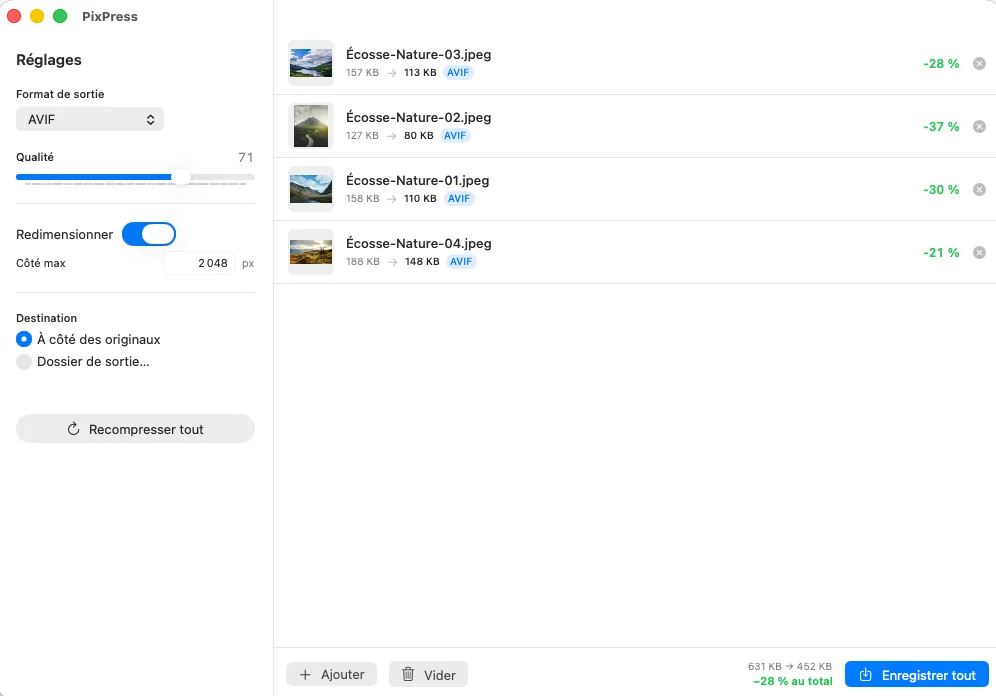

# PixPress

[](https://github.com/fabriquetonvoyage/PixPress/releases/latest)
[](https://github.com/fabriquetonvoyage/PixPress/releases/latest)
[](LICENSE)

Conversion et compression d'images **par lot**, simple et rapide, pour macOS.
Glissez vos images, choisissez le format et la qualité, enregistrez — c'est tout.

Application **native Apple Silicon** (100 % arm64, sans Electron), écrite en
**Swift / SwiftUI** et compilée avec Swift Package Manager. Inspirée de
[Imagine](https://github.com/meowtec/Imagine).



## Télécharger

Application prête à l'emploi (Mac **Apple Silicon**, **macOS 15+**) :

**➜ [Télécharger la dernière version](https://github.com/fabriquetonvoyage/PixPress/releases/latest)**
puis décompressez et placez `PixPress.app` dans **Applications**.

L'app n'étant pas notarisée par Apple, macOS la bloque au premier lancement.
Pour l'autoriser **une seule fois**, exécutez dans le Terminal :

```bash
xattr -dr com.apple.quarantine /Applications/PixPress.app
```

*Alternative sans Terminal :* double-cliquez l'app, puis
**Réglages Système → Confidentialité et sécurité → « Ouvrir quand même »**.

## Fonctionnalités

- Glisser-déposer d'images (ou de dossiers entiers), traitement **par lot**
- Formats de sortie : **WebP** (avec ou sans perte), **JPEG**, **PNG**, **HEIC**, **AVIF**
- Curseur de **qualité**, **redimensionnement** optionnel (côté max, sans agrandissement)
- Aperçu **avant / après** avec pourcentage d'économie par image et au total
- Enregistrement à côté des originaux (sans jamais écraser) ou dans un dossier choisi

## Moteur de compression

| Format | Moteur |
|--------|--------|
| JPEG | **mozjpeg** liée **statiquement** (encodeur progressif + trellis) |
| WebP | **libwebp** liée **statiquement** |
| PNG / HEIC / AVIF | **ImageIO** (framework Apple, natif) |

libwebp et mozjpeg sont liées **statiquement** : l'app ne dépend d'aucune
bibliothèque Homebrew au runtime (vérifiable avec `otool -L`).

## Prérequis pour compiler

- macOS Apple Silicon, outils en ligne de commande Xcode (`xcode-select --install`)
- `libwebp` et `mozjpeg` installées via Homebrew (en-têtes + archives statiques) :
  ```
  brew install webp mozjpeg
  ```

## Construire

```bash
./build.sh          # produit PixPress.app
open PixPress.app
```

Pour installer dans les Applications :

```bash
cp -R PixPress.app /Applications/
```

## Mode ligne de commande

Le binaire embarque un mode CLI pratique pour scripter :

```bash
PixPress.app/Contents/MacOS/PixPress --cli entree.jpg sortie.webp \
    --format webp --quality 80 [--lossless] [--max 2000]
```

Formats : `webp`, `jpeg`, `png`, `heic`, `avif`.

## Notes

- Le **JPEG** est encodé par **mozjpeg** (progressif, quantification trellis) :
  sensiblement plus léger que l'encodeur ImageIO à qualité équivalente.
- Le **PNG** est ré-encodé sans perte (métadonnées supprimées). Pour réduire fortement
  le poids d'un PNG, convertissez-le en **WebP** (avec ou sans perte).

## Publier une version (mainteneur)

Les releases sont automatisées par GitHub Actions
([`.github/workflows/release.yml`](.github/workflows/release.yml)). Pour publier :

```bash
git tag v1.1.0
git push origin v1.1.0
```

Le workflow cale la version de l'app sur le tag, compile sur un runner
Apple Silicon, empaquette `PixPress.app` et crée la release avec l'archive `.zip`.
